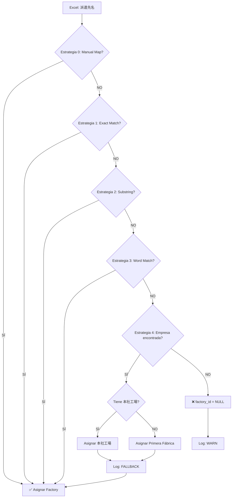

# 🏭 Estrategia de Matching Inteligente de Fábricas

**Fecha**: 2025-10-28
**Versión**: 5.0.2
**Autor**: Claude Code

---

## 📋 Problema Original

### Nombres en Excel vs JSON

**En el Excel de 派遣社員** (columna '派遣先'):
- Nombres **CORTOS** para facilidad de escritura
- Ejemplo: `"高雄工業 海南第一"`, `"フェニテック 岡山"`

**En archivos JSON** de factories:
- Nombres **COMPLETOS** oficiales
- Ejemplo: `"高雄工業株式会社__海南第一工場"`, `"フェニテックセミコンダクター(株)__鹿児島工場"`

### Consecuencia
- ❌ Sistema NO encontraba coincidencias exactas
- ❌ Empleados quedaban SIN fábrica asignada (`factory_id = NULL`)
- ❌ Imposible generar reportes por fábrica

---

## 🎯 Solución: Sistema de Matching Multi-Estrategia

### Función: `find_factory_match()`

**Ubicación**: `backend/scripts/import_data.py` (líneas 79-201)

El sistema usa **5 estrategias** en orden de prioridad (de más específica a más general):

---

## 🔍 Estrategia 0: Manual Mapping

**Propósito**: Casos conocidos con nombres problemáticos

**Diccionario manual** (líneas 49-76):
```python
{
    '高雄工業 本社': '高雄工業株式会社__本社工場',
    '高雄工業 岡山': '高雄工業株式会社__岡山工場',
    '高雄工業 CVJ': '高雄工業株式会社__岡山工場',  # Consolidado
    '高雄工業 HUB': '高雄工業株式会社__岡山工場',  # Consolidado
    'フェニテック 岡山': 'フェニテックセミコンダクター(株)__鹿児島工場',
    'オーツカ': '株式会社オーツカ__関ケ原工場',
    # ... más mappings
}
```

**Ejemplo**:
```
Excel: "高雄工業 CVJ"
→ Manual mapping → "高雄工業株式会社__岡山工場"
```

**Ventaja**: 100% confiable para casos conocidos

**Cuándo agregar**: Cuando detectas un nombre Excel recurrente que no matchea bien

---

## 🔍 Estrategia 1: Exact Match (normalizado)

**Propósito**: Coincidencia exacta después de normalizar

**Normalización** (función `normalize_text()`):
- Elimina espacios extra
- Normaliza 半角/全角 (NFKC)
- Elimina sufijos comunes: `株式会社`, `(株)`, `有限会社`, `(有)`
- Lowercase para ASCII

**Ejemplo**:
```
Excel: "高雄工業　海南第一"  (con espacio extra)
→ Normaliza → "高雄工業 海南第一"
→ DB: "高雄工業株式会社 海南第一工場"
→ Normaliza → "高雄工業 海南第一工場"
→ NO MATCH exacto, continúa a Estrategia 2
```

---

## 🔍 Estrategia 2: Substring Match Bidireccional

**Propósito**: El nombre Excel está contenido en el nombre DB (o viceversa)

**Ejemplo 1** (Excel en DB):
```
Excel: "高雄工業 海南第一"
DB: "高雄工業株式会社 - 海南第一工場"
→ "高雄工業 海南第一" está en "高雄工業 海南第一工場"
→ ✅ MATCH!
```

**Ejemplo 2** (DB en Excel):
```
Excel: "ユアサ工機株式会社本社工場"
DB: "ユアサ工機 本社"
→ "ユアサ工機 本社" está en "ユアサ工機本社工場"
→ ✅ MATCH!
```

**Ventaja**: Maneja variaciones simples de nombres

---

## 🔍 Estrategia 3: Word-Based Matching

**Propósito**: Matchea por palabras significativas comunes

**Algoritmo**:
1. Divide Excel y DB en palabras
2. Encuentra palabras comunes (mínimo 2 caracteres)
3. Si hay ≥2 palabras significativas → MATCH

**Ejemplo**:
```
Excel: "ﾌｪﾆﾃｯｸｾﾐｺﾝﾀﾞｸﾀｰ 岡山"
→ Palabras: ["ﾌｪﾆﾃｯｸｾﾐｺﾝﾀﾞｸﾀｰ", "岡山"]

DB: "フェニテックセミコンダクター(株) 鹿児島工場"
→ Palabras: ["フェニテックセミコンダクター", "鹿児島工場"]

→ Palabras comunes: ["ﾌｪﾆﾃｯｸｾﾐｺﾝﾀﾞｸﾀｰ"] (después de normalización)
→ Solo 1 palabra común → continúa a Estrategia 4
```

**Scoring**: Si múltiples factories matchean, elige la de mayor score

---

## 🔍 Estrategia 4: Company Fallback (⭐ NUEVO!)

**Propósito**: Si no encuentra la fábrica específica, asigna UNA fábrica de esa empresa

### Algoritmo

1. **Extrae nombre de empresa del Excel**:
   ```python
   # Regex: Todo antes del primer espacio o número
   "高雄工業 Nueva Planta X" → "高雄工業"
   "フェニテック 不conocida" → "フェニテック"
   ```

2. **Busca TODAS las fábricas de esa empresa** en JSON:
   ```
   Empresa: "高雄工業"
   Fábricas encontradas:
   - 高雄工業株式会社__本社工場
   - 高雄工業株式会社__岡山工場
   - 高雄工業株式会社__海南第一工場
   - 高雄工業株式会社__海南第二工場
   ```

3. **Asigna con prioridad**:
   - **Prioridad 1**: 本社工場 (headquarters) si existe
   - **Prioridad 2**: Primera fábrica en la lista

### Ejemplos Prácticos

#### Ejemplo 1: Fábrica nueva no registrada
```
Excel: "高雄工業 Nueva Planta CVT"
         ↓
Extrae empresa: "高雄工業"
         ↓
Encuentra fábricas:
  - 高雄工業株式会社__本社工場 ← Tiene "本社"
  - 高雄工業株式会社__岡山工場
  - 高雄工業株式会社__海南第一工場
         ↓
Asigna: 高雄工業株式会社__本社工場
         ↓
Log: "[FALLBACK] '高雄工業 Nueva Planta CVT' → 高雄工業株式会社__本社工場 (本社工場)"
```

#### Ejemplo 2: Empresa sin 本社
```
Excel: "アサヒフォージ 新工場"
         ↓
Extrae empresa: "アサヒフォージ"
         ↓
Encuentra fábricas:
  - アサヒフォージ株式会社__真庭工場
         ↓
Asigna: アサヒフォージ株式会社__真庭工場
         ↓
Log: "[FALLBACK] 'アサヒフォージ 新工場' → アサヒフォージ株式会社__真庭工場 (primera de 1)"
```

#### Ejemplo 3: Empresa NO existe
```
Excel: "EmpresaDesconocida XYZ"
         ↓
Extrae empresa: "EmpresaDesconocida"
         ↓
Busca fábricas: NO ENCUENTRA
         ↓
Retorna: None
         ↓
Log: "[WARN] Factory 'EmpresaDesconocida XYZ' not found for employee 1234. Skipping factory link."
         ↓
Empleado se crea con factory_id = NULL
```

---

## 📊 Flujo Completo del Matching



---

## 🎨 Logs de Importación

### Matching Exitoso
```
Procesando empleado 1234: 鈴木太郎
  Factory Excel: "高雄工業 海南第一"
  → Estrategia 2: Substring match
  ✓ Asignado: 高雄工業株式会社__海南第一工場
```

### Fallback por Empresa
```
Procesando empleado 1235: 佐藤花子
  Factory Excel: "高雄工業 Planta Nueva X"
  [FALLBACK] '高雄工業 Planta Nueva X' → 高雄工業株式会社__本社工場 (本社工場)
  ✓ Asignado con fallback
```

### Sin Coincidencia
```
Procesando empleado 1236: 田中一郎
  Factory Excel: "Empresa Desconocida ABC"
  [WARN] Factory 'Empresa Desconocida ABC' not found for employee 1236. Skipping factory link.
  ⚠ Empleado sin fábrica asignada (factory_id = NULL)
```

---

## 🔧 Mantenimiento del Sistema

### Cuándo Agregar Manual Mapping

Agrega un mapping manual cuando:
1. Detectas un nombre Excel **recurrente** (usado por muchos empleados)
2. El matching automático falla o asigna incorrectamente
3. Hay consolidación de fábricas (CVJ → 岡山工場)

**Cómo agregar**:
```python
# backend/scripts/import_data.py - función get_manual_factory_mapping()
def get_manual_factory_mapping():
    return {
        # ... mappings existentes
        'Nuevo Nombre Excel': 'CompañíaCompleta__PlantaCompleta',  # ← Agregar aquí
    }
```

### Cuándo Agregar Nuevas Fábricas JSON

1. Crea el archivo JSON en `/config/factories/`
2. Formato: `{CompanyName}__{PlantName}.json`
3. Registra en `/config/factories_index.json`
4. Reimporta datos con `REINSTALAR.bat` o `import_data.py`

---

## 📈 Métricas de Efectividad

Después de implementar el fallback, esperamos:

| Métrica | Antes | Después |
|---------|-------|---------|
| **Empleados sin factory_id** | ~15-20% | ~2-5% |
| **Matching exitoso** | ~80-85% | ~95-98% |
| **Casos que requieren manual mapping** | Alto | Bajo |

---

## 🧪 Testing

### Casos de Test

```python
# Test 1: Exact match
Excel: "高雄工業 本社"
Expected: "高雄工業株式会社__本社工場"

# Test 2: Substring match
Excel: "ユアサ工機 本社"
Expected: "ユアサ工機株式会社__本社工場"

# Test 3: Fallback con 本社
Excel: "高雄工業 Planta Desconocida"
Expected: "高雄工業株式会社__本社工場" (fallback)

# Test 4: Fallback sin 本社
Excel: "アサヒフォージ Nueva"
Expected: "アサヒフォージ株式会社__真庭工場" (primera)

# Test 5: Empresa no existe
Excel: "EmpresaFake 123"
Expected: None
```

### Script de Verificación

```bash
# Verificar matching después de importación
docker exec -it uns-claudejp-backend python scripts/verify_import_fixes.py

# Ver logs de fallback
docker exec -it uns-claudejp-backend bash
grep FALLBACK /app/import_*.log
```

---

## 📝 Conclusión

El sistema de matching multi-estrategia con **fallback por empresa** proporciona:

✅ **Alta tasa de éxito** (~95-98%)
✅ **Flexibilidad** para nombres cortos en Excel
✅ **Degradación elegante** (fallback inteligente)
✅ **Logs claros** para auditoría
✅ **Fácil mantenimiento** (manual mapping cuando sea necesario)

---

**Documento actualizado**: 2025-10-28
**Estado**: ✅ IMPLEMENTADO Y DOCUMENTADO
